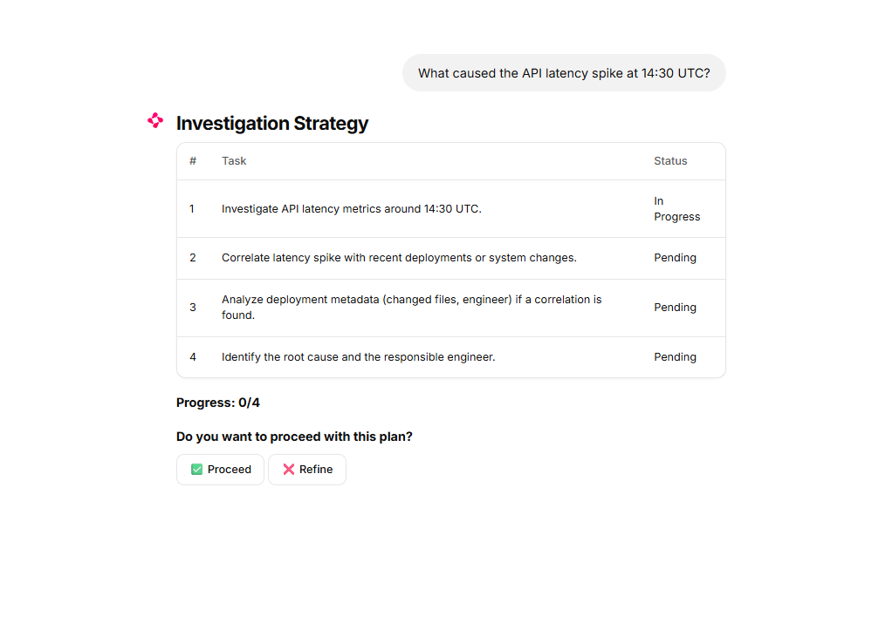
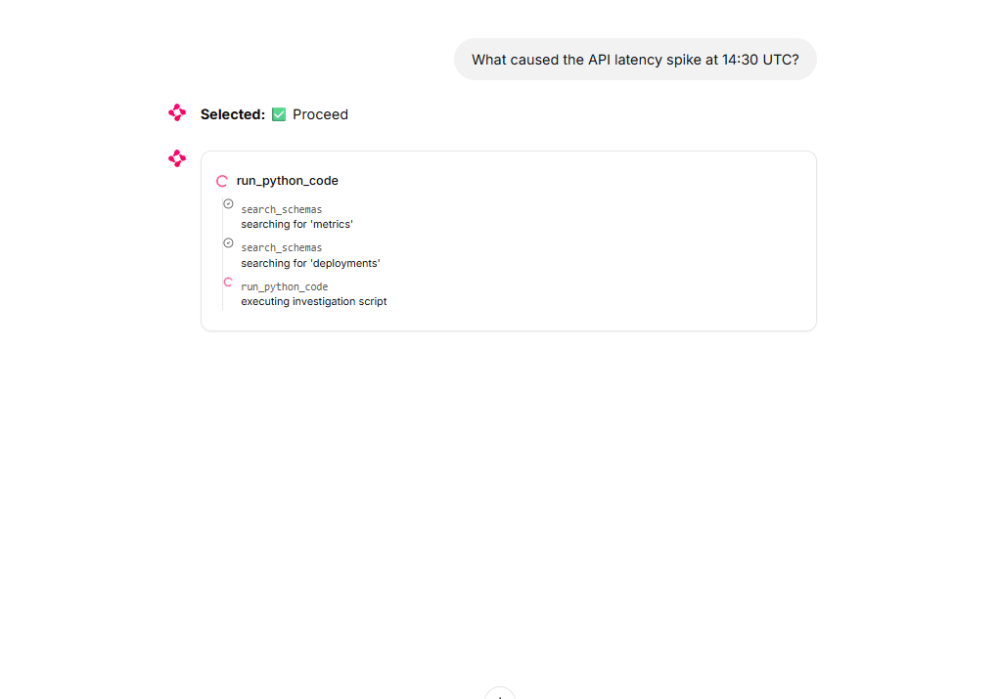
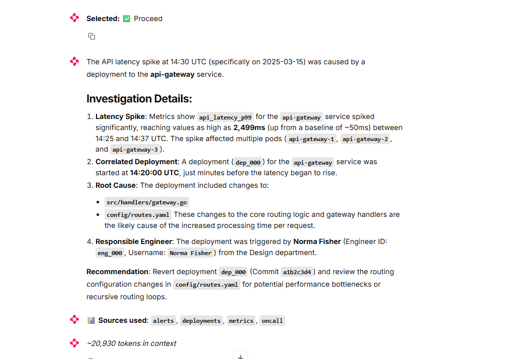

# Strake Agent Example (DevOps Support Agent)

This is a DevOps assistant built using Strake, PydanticAI, and Chainlit. It’s for those times when you need to dig into an incident but the data is scattered across SQL, Parquet files, and separate APIs. 

This project is a demonstration of how to build sophisticated data-driven agents. You can use it as a blueprint for your own implementations that need to correlate across multiple sources or execute analysis in secure sandboxes.


## Key Features

- **It plans its work.** You'll get a todo list to approve before the agent touches any production data.
- **No context bloat.** When the chat gets long, it summarizes the history so it doesn't hit token limits.
- **Work stays in the sandbox.** The agent writes and runs Python locally via Strake. This means it only brings the final analysis back to the LLM, rather than trying to stuff millions of raw rows into the prompt.
- **Correlates everything.** You can join SQL, Parquet, and REST data without needing to set up an ETL pipeline first.

## How it works

The core idea is letting the agent "think in code." Instead of a typical RAG approach, the agent writes a script to analyze data where it lives. Strake executes that script in a secure sandbox and returns only the summarized facts. 





### The Data Sources
- **Alerts**: 10,000 production alerts in SQLite.
- **Metrics**: 1 million data points in Parquet.
- **Deployments**: 200 recent change logs in JSON.
- **On-call**: Engineer rotas in CSV.
- **Team Info**: A mock REST API for git metadata.

## Setup

Make sure you have `uv` installed.

### 1. Install and Prep
```bash
uv sync
uv run scripts/init_data.py
```

### 2. Run the backends
You'll need both the Strake server and the mock API running in the background:
```bash
# Strake MCP server
uv run python -m strake.mcp --transport sse --port 8001 --config config/strake.yaml

# Mock REST API
uv run scripts/mock_webserver.py
```

### 3. Log in and Investigate
```bash
uv run chainlit run app.py
```

## Configuration

Drop your API keys into a `.env` file. You can switch between providers by setting `MODEL_PROVIDER` to `google`, `openai`, or `anthropic`. 

- **Google (Gemini)**: Use `MODEL_PROVIDER=google` and set `GEMINI_API_KEY`. Defaults to `gemini-3-pro-preview`.
- **OpenAI (GPT)**: Use `MODEL_PROVIDER=openai` and set `OPENAI_API_KEY`. Defaults to `gpt-5.3-codex`.
- **Anthropic (Claude)**: Use `MODEL_PROVIDER=anthropic` and set `ANTHROPIC_API_KEY`. Defaults to `claude-4-5-sonnet-latest`.

If you leave `MODEL_NAME` blank, it will use the version-specific defaults listed above (or the latest available previews).

## Customizing the Agent

The agent's "Expertise" is just a collection of markdown files in the `skills/` directory. Each `SKILL.md` is essentially an SOP. If you want the agent to handle a specific type of failure, just add a new file with the instructions. It will pick them up automatically when it builds its next investigation plan.
